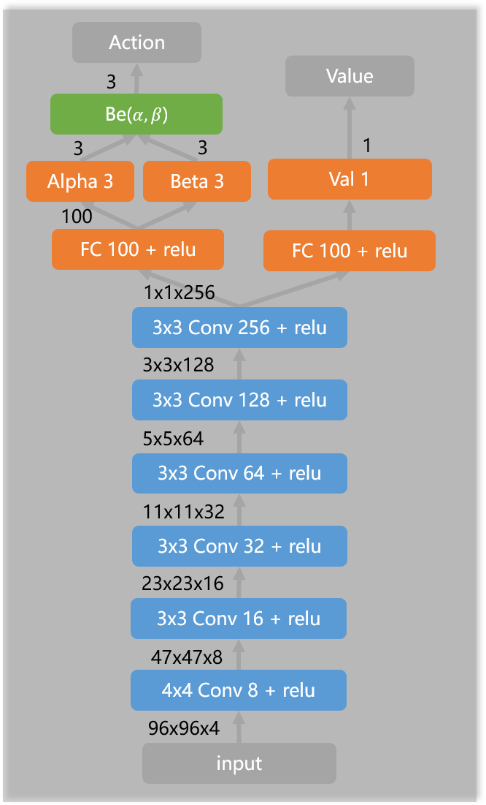
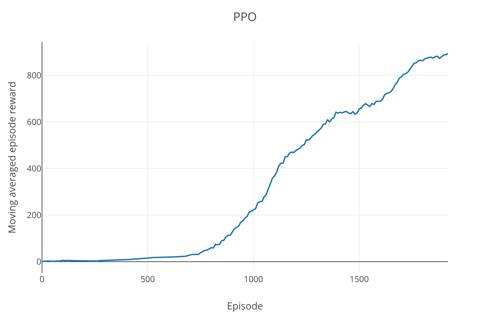

# Car Racing with PyTorch
Solving the car racing problem in OpenAI Gym. This problem has a real physical engine in the back end. You can achieve real racing actions in the environment, like drifting. 

## Requirement
To run the code, you need
- [pytorch](https://pytorch.org/)
- [gym 0.26](https://github.com/openai/gym)
- [visdom 0.1.8](https://github.com/facebookresearch/visdom)

## Method
The Reinforcement learning Algorithm is PPO:  
（Every action will be repeated for 8 frames. To get velocity information, state is defined as adjacent 4 frames in shape (4, 96, 96). Use a two heads FCN to represent the actor and critic respectively. The actor outputs α, β for each actin as the parameters of Beta distribution.）
<div align=center></div>

## Usage
Start a Visdom server with ```python -m visdom.server```, it will serve http://localhost:8097/ by default.

To train the agent run ```python run.py --render --vis``` or ```python run.py --render``` without visdom. 
To test, run ```python run.py (--render) --valid```.

## Performance
<div align=center></div>
